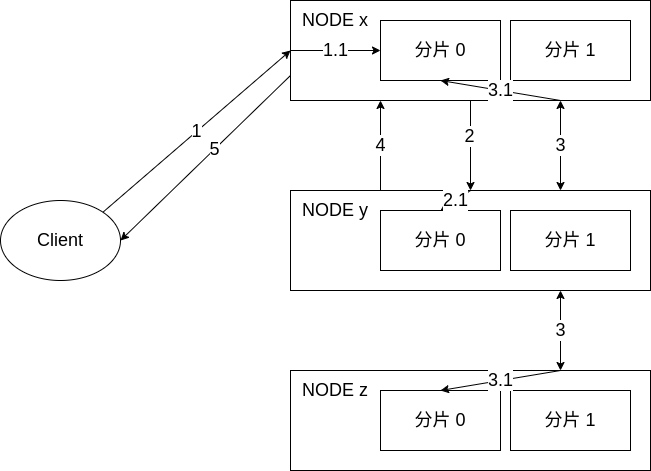
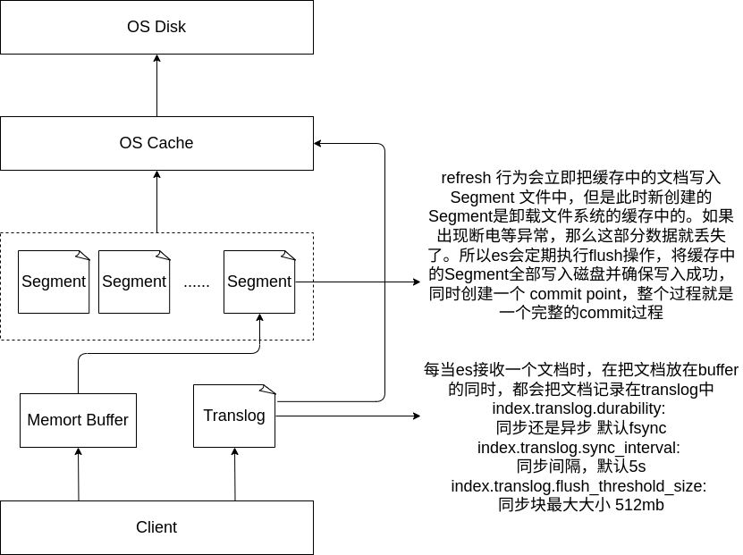
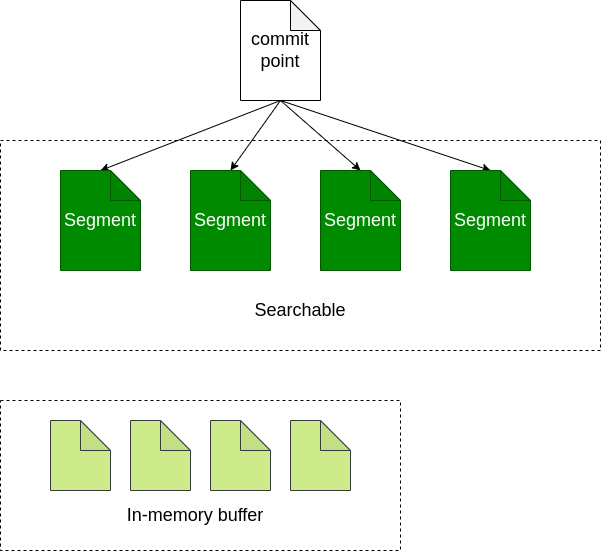
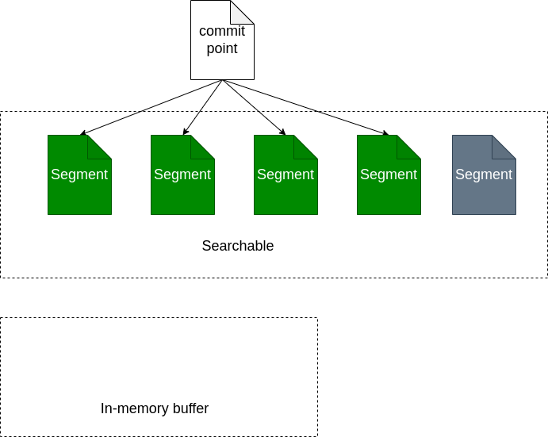
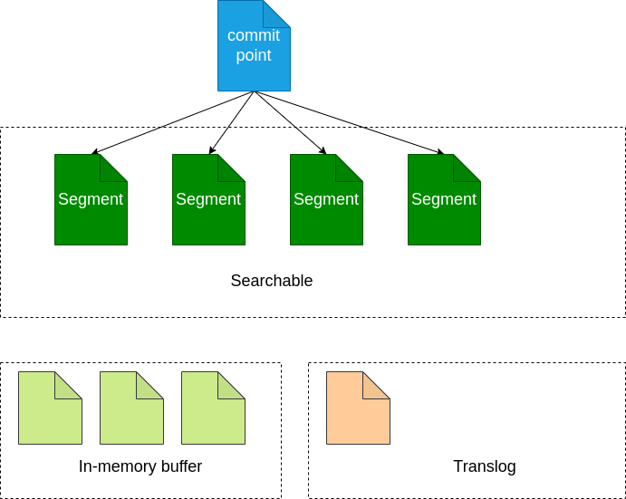
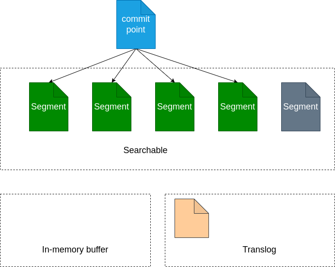
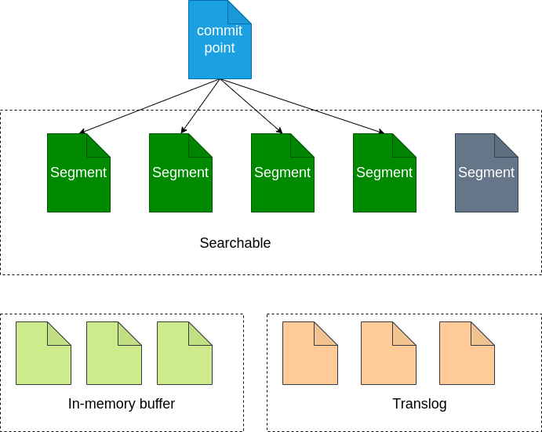
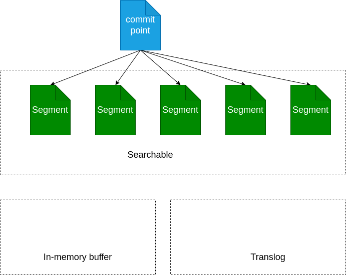
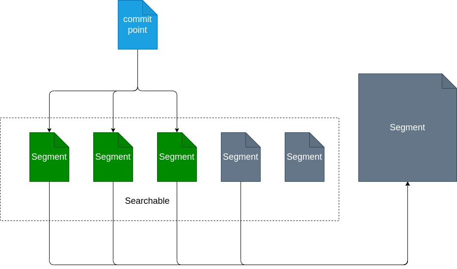

# ES 的写入过程

## ES支持的4种写操作
- [create](https://www.elastic.co/guide/en/elasticsearch/reference/current/docs-index_.html): 如果在PUT数据时，当前数据已经存在，则数据会被覆盖，如果在PUT的时候加上操作类型 create，此时如果数据已经存在则会返回失败，因为已经强制指定了操作类型 create，ES就不过在去执行 update 操作。比如：`PUT /pruduct/_create/1/` （ 老版本的语法为 `PUT /pruduct/_doc/1/_create` ）指的就是在索引product中强制创建id为1的数据，如果id为1的数据已存在，则返回失败。
  > To **add or overwrite** a document using the `PUT /<target>/_doc/<_id>` request format, you must have the create, index, or write index privilege.
  > To **add** a document using the `POST /<target>/_doc/, PUT /<target>/_create/<_id>`, or `POST /<target>/_create/<_id>` request formats, you must have the create_doc, create, index, or write index privilege.
  > To automatically create a data stream or index with an index API request, you must have the auto_configure, create_index, or manage index privilege.
- [delete](https://www.elastic.co/guide/en/elasticsearch/reference/current/docs-delete.html): 删除文档，ES对文档的删除是懒删除机制，即标记删除。
  > `DELETE /<index>/_doc/<_id>`
- [index]((https://www.elastic.co/guide/en/elasticsearch/reference/current/docs-index_.html)): 在ES中，写入操作被称为Index，这里Index为动词，即索引数据为 将数据创建在ES中的索引。
- [update](https://www.elastic.co/guide/en/elasticsearch/reference/current/docs-update.html): 执行partial update（全量替换，部分替换）
  > Enables you to script document updates. The script can update, delete, or skip modifying the document. The update API also supports passing a partial document, which is merged into the existing document. To fully replace an existing document, use the index API.

## ES 写流程



ES中的数据写入均发生在Primary Shard(主分片)，当数据在Primary写入完成之后会同步到相应的Replica Shard。
数据写入的步骤：
- 客户端发起写入请求至node x <sub><sup>(1)</sub></sup>
- node x 通过文档 id 在路由表中的映射信息确定当前数据的位置为分片0 <sub><sup>(1.1)</sub></sup>，分片0 的主分片位于node y，并将数据转发至node y <sub><sup>(2)</sub></sup>。
- 数据在node y写入 <sub><sup>(2.1)</sub></sup>，写入成功之后将数据的同步请求转发至其副本所在的node x和node z上面 <sub><sup>(3)</sub></sup>，等待所有副本（具体等待多少副本取决于`wait_for_active_shards`的配置值）数据写入成功之后node y 将结果报告node x <sub><sup>(4)</sub></sup>，并由 node x 将结果返回给客户端 <sub><sup>(5)</sub></sup>，报告数据写入成功。

在这个过程中，接收用户请求的节点是不固定的，上述例子中，node x 发挥了协调节点和客户端节点的作用，将数据转发至对应节点和接收以及返回用户请求。

数据在由 node x 转发至 node y的时候，是通过以下公式来计算，指定的文档具体在那个分片的: `shard_num = hash(_routing) % num_primary_shards` 其中，_routing 的默认值是文档的 id。

## 写一致性策略
ES 5.x 之后，一致性策略由 `wait_for_active_shards` 参数控制：
即确定客户端返回数据之前必须处于active 的分片分片数（包括主分片和副本），默认为 wait_for_active_shards = 1，即只需要主分片写入成功，设置为 all或任何正整数，最大值为索引中的分片总数 ( number_of_replicas + 1 )。如果当前 active 状态的副本没有达到设定阈值，写操作必须等待并且重试，默认等待时间30秒，直到 active 状态的副本数量超过设定的阈值或者超时返回失败为止。

执行索引操作时，分配给执行索引操作的主分片可能不可用。造成这种情况的原因可能是主分片当前正在从网关恢复或正在进行重定位。默认情况下，索引操作将在主分片上等待最多 1 分钟，然后才会失败并返回错误。

# ES 的写入原理
## 图解:


## 概念和原理
### Segment
lucene将一个大的逆向索引拆分成了多个小的段segment。每个segment本质上就是一个逆向索引。在lucene中，同时还会 **维护一个文件commit point，用来记录当前所有可用的segment** ，当我们在这个commit point上进行搜索时，就相当于在它下面的segment中进行搜索，每个segment返回自己的搜索结果，然后进行汇总返回给用户。


- 1.新增的文档首先会被存放在内存的缓存中
- 2.当文档数足够多或者到达一定时间点时，就会对缓存进行commit
  - a.生成一个新的segment，并写入磁盘
  - b.生成一个新的commit point，记录当前所有可用的segment
  - c.等待所有数据都已写入磁盘
- 3.打开新增的segment，这样我们就可以对新增的文档进行搜索了
- 4.清空缓存，准备接收新的文档

### 文档的更新与删除：
每个commit point都会维护一个`.del`文件，文件内记录了在某个segment内某个文档已经被删除。在segment中，被删除的文档依旧是能够被搜索到的，不过在返回搜索结果前，会根据`.del`把那些已经删除的文档从搜索结果中过滤掉。

对于 **文档的更新，采用和删除文档类似的实现方式** 。当一个文档发生更新时，首先会在.del中声明这个文档已经被删除，同时新的文档会被存放到一个新的segment中。这样在搜索时，虽然新的文档和老的文档都会被匹配到，但是.del会把老的文档过滤掉，返回的结果中只包含更新后的文档。

### Refresh
ES的一个特性就是提供实时搜索，新增加的文档可以在很短的时间内就被搜索到。在创建一个commit point时，为了确保所有的数据都已经成功写入磁盘，避免因为断电等原因导致缓存中的数据丢失，在创建segment时需要一个fsync的操作来确保磁盘写入成功。但是如果每次新增一个文档都要执行一次fsync就会产生很大的性能影响。在文档被写入segment之后，segment首先被写入了文件系统的缓存中，这个过程仅使用很少的资源。之后segment会从文件系统的缓存中逐渐flush到磁盘，这个过程时间消耗较大。但是实际上存放在文件缓存中的文件同样可以被打开读取。ES利用这个特性，在segment被commit到磁盘之前，就打开对应的segment，这样存放在这个segment中的文档就可以立即被搜索到了。

上图中灰色部分即存放在缓存中，还没有被commit到磁盘的segment。此时这个segment已经可以进行搜索。

### Translog
对索引的修改操作在会 Lucene 执行 commit 之后真正持久化到磁盘，这个过程是非常消耗资源的，因此不可能在每次索引操作或删除操作后执行。Lucene 提交的成本太高，无法对每个单独的更改执行，因此每个分片副本还将操作写入其 事务日志，也就是 translog 。
- 每当es接收一个文档时，在把文档放在buffer的同时，都会把文档记录在translog中。

- 执行refresh操作时，会将缓存中的文档写入segment中，但是此时segment是放在缓存中的，并没有落入磁盘，此时新创建的segment是可以进行搜索的。

- 按照如上的流程，新的segment继续被创建，同时这期间新增的文档会一直被写到translog中。

- 当达到一定的时间间隔，或者translog足够大时，就会执行commit行为，将所有缓存中的segment写入磁盘。确保写入成功后，translog就会被清空。

执行commit并清空translog的行为，在es中可以通过_flush api进行手动触发。
```sh
curl -X POST ${ES_HOST}/${index}/_flush?v
```
通常这个flush行为不需要人工干预，交给es自动执行就好了。同时，**在重启es或者关闭索引之间，建议先执行flush行为，确保所有数据都被写入磁盘，避免照成数据丢失**。

所有索引和删除操作在被内部 Lucene 索引之前写入到 translog。如果发生崩溃，当分片恢复时，已确认但尚未包含在最后一次 Lucene 提交中的最近操作将从 translog 中恢复。
Elasticsearch Flush 是Lucene 执行 commit 并开始写入新的 translog 的过程。刷新是在后台自动执行的，以确保 translog 不会变得太大，这将导致在恢复期间重放其操作需要相当长的时间。手动执行刷新的能力也通过 API 公开，但是一般并不需要。
translog 中的数据仅在 translog 被执行 `fsync` 和 `commit` 时才会持久化到磁盘。如果发生硬件故障或操作系统崩溃或 JVM 崩溃或分片故障，自上次 translog 提交以来写入的任何数据都将丢失。

虽然translog是用来防止数据丢失,但是也有数据丢失的风险。

写translog，并不是每个写操作或者更新操作，都立刻写入到磁盘。因为写translog也是有同步和异步两种模式的，在异步模式下translog只有被fsync才会被写入到磁盘。正是`index.translog.sync_interval`这个配置参数，决定了多久出发一次fsync，默认是`5s`，这意味着，在这5s内发生断电，数据也是回被丢失的。

`index.translog.durability`这配置参数，可以控制translog是同步还是异步。决定了是否在每次写数据或者修改数据就触发一次fsync。es的默认是`index.translog.durability=request`。也就是每次都触发fsync。

如果制定`index.translog.durability=async` 那么就要面临丢数据的风险了。

translog日志的大小也不能是无限大的，因为它的大小，则决定了集群崩溃后恢复的时间长短。如果太大，则会面临集群恢复很久的问题。`index.translog.flush_threshold_size` 这个参数就是指定translog日志最大的大小的。默认为512M。意思是当translog日志大于512M，就一定会触发一次flush，将数据从文件系统落到磁盘上，并将translog清理掉。

### Segment的合并
- es会定期的将收到的文档写入新的segment中，这样经过一段时间之后，就会出现很多segment。但是每个segment都会占用独立的文件句柄/内存/消耗cpu资源，而且，在查询的时候，需要在每个segment上都执行一次查询，这样是很消耗性能的。

- 为了解决这个问题，es会自动定期的将多个小segment合并为一个大的segment。前面讲到删除文档的时候，并没有真正从segment中将文档删除，而是维护了一个.del文件，但是当segment合并的过程中，就会自动将.del中的文档丢掉，从而实现真正意义上的删除操作。
- 当新合并后的segment完全写入磁盘之后，es就会自动删除掉那些零碎的segment，之后的查询都在新合并的segment上执行。Segment的合并会消耗大量的IO和cpu资源，这会影响查询性能。

- 在es中，可以使用optimize接口，来控制segment的合并。
  ```sh
  curl -X POST ${ES_HOST}/${index}/_optimize?max_num_segments=1
  ```

### 关于 refresh 和 flush
[refresh-vs-flush](https://stackoverflow.com/questions/19963406/refresh-vs-flush)
A `refresh` effectively calls a reopen on the lucene index reader, so that the point in time snapshot of the data that you can search on gets updated. This lucene feature is part of the lucene near real-time api.
An elasticsearch `refresh` makes your documents available for search, but it **doesn't make sure that they are written to disk to a persistent storage**, as it doesn't call fsync, thus doesn't guarantee durability. What makes your data durable is a lucene commit, which is way more expensive.

An elasticsearch `flush` effectively triggers a **lucene commit**, and empties also the transaction log, since once **data is committed on the lucene level, durability can be guaranteed by lucene itself**. `Flush` is exposed as an api too and can be tweaked, although usually that is not necessary. `Flush` happens automatically depending on how many operations get added to the transaction log, how big they are, and when the last `flush` happened.

#### refresh 设置刷新间隔
`index.refresh_interval`：多久执行一次刷新操作，这使得对索引的最近更改对搜索可见。默认为 1s. 可以设置 -1 为禁用刷新。
并不是所有的情况都需要每秒刷新。比如 Elasticsearch 索引大量的日志文件，此时并不需要太高的写入实时性， 可以通过设置 `refresh_interval` ，增大刷新间隔来降低每个索引的刷新频率，从而降低因为实时性而带来的性能开销。进而提升检索效率。
```json
POST <index_name>
{
    "settings": {
    "refresh_interval": "30s"
  }
}
```
强制对索引刷新:
```sh
POST <target>/_refresh
GET <target>/_refresh
POST /_refresh
GET /_refresh
```

## 写入性能调优

### 基本原则
写性能调优是建立在对 Elasticsearch 的写入原理之上。ES 数据写入具有一定的延时性，这是为了减少频繁的索引文件产生。默认情况下 ES 每秒生成一个 segment 文件，当达到一定阈值的时候 会执行merge，merge 过程发生在 JVM中，频繁的生成 Segmen 文件可能会导致频繁的触发 FGC，导致 OOM。为了避免避免这种情况，通常采取的手段是降低 segment 文件的生成频率，手段有两个，一个是 增加时间阈值，另一个是增大 Buffer的空间阈值，因为缓冲区写满也会生成 Segment 文件。
生产经常面临的写入可以分为两种情况：

- 高频低量：高频的创建或更新索引或文档一般发生在 处理 C 端业务的场景下。
- 低频高量：一般情况为定期重建索引或批量更新文档数据。

在搜索引擎的业务场景下，用户一般并不需要那么高的写入实时性。比如你在网站发布一条征婚信息，或者二手交易平台发布一个商品信息。其他人并不是马上能搜索到的，这其实也是正常的处理逻辑。这个延时的过程需要处理很多事情，业务层面比如：你的信息需要后台审核。你发布的内容在搜索服务中需要建立索引，而且你的数据可能并不会马上被写入索引，而是等待要写入的数据达到一定数量之后，批量写入。这种操作优点类似于我们快递物流的场景，只有当快递数量达到一定量级的时候，比如能装满整个车的时候，快递车才会发车。因为反正是要跑一趟，装的越多，平均成本越低。这和我们数据写入到磁盘的过程是非常相似的，我们可以把一条文档数据看做是一个快递，而快递车每次发车就是向磁盘写入数据的一个过程。这个过程不宜太多，太多只会降低性能，就是体现在运输成本上面。而对于我们数据写入而言就是体现在我们硬件性能损耗上面。

### 优化手段
以下为常见 数据写入的调优手段，**写入调优均以提升写入吞吐量和并发能力为目标，而非提升写入实时性**。
#### 增加 flush 时间间隔
目的是减小数据写入磁盘的频率，减小磁盘IO频率。

#### 增加refresh_interval的参数值
目的是减少segment文件的创建，减少segment的merge次数，merge是发生在jvm中的，有可能导致full GC，增加refresh会降低搜索的实时性。
默认情况下，Elasticsearch 每秒定期刷新索引，但仅在最近 30 秒内收到一个或多个搜索请求的索引上。
如果没有搜索流量或搜索流量很少（例如每 5 分钟不到一个搜索请求）并且想要优化索引速度，这是最佳配置。此行为旨在在不执行搜索的默认情况下自动优化批量索引。建议显式配置此配置项，如 30秒。

#### 增加Buffer大小
本质也是减小refresh的时间间隔，因为导致segment文件创建的原因不仅有时间阈值，还有buffer空间大小，写满了也会创建。默认**最小值 48MB< 默认值 JVM 空间的10% < 默认最大无限制**

#### 关闭副本
当需要单次写入大量数据的时候，建议关闭副本，暂停搜索服务，或选择在检索请求量谷值区间时间段来完成。
第一，是减小读写之间的资源抢占，读写分离 第二，当检索请求数量很少的时候，可以减少甚至完全删除副本分片，关闭segment的自动创建以达到高效利用内存的目的，因为副本的存在会导致主从之间频繁的进行数据同步，大大增加服务器的资源占用。具体可通过则**设置index.number_of_replicas 为0以加快索引速度**。没有副本意味着丢失单个节点可能会导致数据丢失，**因此数据保存在其他地方很重要，以便在出现问题时可以重试初始加载。初始加载完成后，可以设置index.number_of_replicas改回其原始值**。

#### 禁用swap
大多数操作系统尝试将尽可能多的内存用于文件系统缓存，并急切地换掉未使用的应用程序内存。这可能导致部分 JVM 堆甚至其可执行页面被换出到磁盘。
交换对性能和节点稳定性非常不利，应该不惜一切代价避免。它可能导致垃圾收集持续几分钟而不是几毫秒，并且可能导致节点响应缓慢甚至与集群断开连接。在Elastic分布式系统中，让操作系统杀死节点更有效。

#### 使用多个工作线程
- 发送批量请求的单个线程不太可能最大化 Elasticsearch 集群的索引容量。为了使用集群的所有资源，应该从多个线程或进程发送数据。除了更好地利用集群的资源外，还有助于降低每个 fsync 的成本。
- 确保注意 TOO_MANY_REQUESTS (429)响应代码（EsRejectedExecutionException使用 Java 客户端），这是 Elasticsearch 告诉我们它无法跟上当前索引速度的方式。发生这种情况时，应该在重试之前暂停索引，最好使用随机指数退避。
- 与调整批量请求的大小类似，只有测试才能确定最佳工作线程数量是多少。这可以通过逐渐增加线程数量来测试，直到集群上的 I/O 或 CPU 饱和。

#### 避免使用稀疏数据

#### max_result_window参数
max_result_window是分页返回的最大数值，默认值为10000。
max_result_window本身是对JVM的一种保护机制，通过设定一个合理的阈值，避免初学者分页查询时由于单页数据过大而导致OOM。
在很多业务场景中经常需要查询10000条以后的数据，当遇到不能查询10000条以后的数据的问题之后，网上的很多答案会告诉你可以通过放开这个参数的限制，将其配置为100万，甚至1000万就行。但是如果仅仅放开这个参数就行，那么这个参数限制的意义有何在呢？如果你不知道这个参数的意义，很可能导致的后果就是频繁的发生OOM而且很难找到原因，设置一个合理的大小是需要通过你的各项指标参数来衡量确定的，比如你用户量、数据量、物理内存的大小、分片的数量等等。通过监控数据和分析各项指标从而确定一个最佳值，并非越大越好

## 查询调优

### 读写性能不可兼得
首先要明确一点：鱼和熊掌不可兼得。读写性能调优在很多场景下是只能二选一的。牺牲 A 换 B 的行为非常常见。索引本质上也是通过空间换取时间。写生写入实时性就是为了提高检索的性能。

当你在二手平台或者某垂直信息网站发布信息之后，是允许有信息写入的延时性的。但是检索不行，甚至 1 秒的等待时间对用户来说都是无法接受的。满足用户的要求甚至必须做到10 ms以内。

### 优化手段

#### 避免单次召回大量数据
搜索引擎最擅长的事情是从海量数据中查询少量相关文档，而非单次检索大量文档。非常不建议动辄查询上万数据。如果有这样的需求，建议使用滚动查询

#### 避免单个文档过大
鉴于默认`http.max_content_length`设置为 100MB，Elasticsearch 将拒绝索引任何大于该值的文档。您可能决定增加该特定设置，但 Lucene 仍然有大约 **2GB** 的限制。
即使不考虑硬性限制，大型文档通常也不实用。大型文档对网络、内存使用和磁盘造成了更大的压力，即使对于不请求的搜索请求也是如此，_source因为 Elasticsearch_id在所有情况下都需要获取文档的文件系统缓存有效。对该文档进行索引可能会占用文档原始大小的倍数的内存量。Proximity Search（例如短语查询）和高亮查询也变得更加昂贵，因为它们的成本直接取决于原始文档的大小。
有时重新考虑信息单元应该是什么是有用的。例如，您想让书籍可搜索的事实并不一定意味着文档应该包含整本书。使用章节甚至段落作为文档可能是一个更好的主意，然后在这些文档中拥有一个属性来标识它们属于哪本书。这不仅避免了大文档的问题，还使搜索体验更好。例如，如果用户搜索两个单词fooand bar，则不同章节之间的匹配可能很差，而同一段落中的匹配可能很好。

#### 单次查询10条文档 好于 10次查询每次一条
批量请求将产生比单文档索引请求更好的性能。但是每次查询多少文档最佳，不同的集群最佳值可能不同，为了获得批量请求的最佳阈值，建议在具有单个分片的单个节点上运行基准测试。首先尝试一次索引 100 个文档，然后是 200 个，然后是 400 个等。在每次基准测试运行中，批量请求中的文档数量翻倍。当索引速度开始趋于平稳时，就可以获得已达到数据批量请求的最佳大小。在相同性能的情况下，当大量请求同时发送时，太大的批量请求可能会使集群承受内存压力，因此建议避免每个请求超过几十兆字节。

#### 数据建模
很多人会忽略对 Elasticsearch 数据建模的重要性。
nested属于object类型的一种，是Elasticsearch中用于复杂类型对象数组的索引操作。Elasticsearch没有内部对象的概念，因此，ES在存储复杂类型的时候会把对象的复杂层次结果扁平化为一个键值对列表。
特别是，**应避免连接**。**Nested 可以使查询慢几倍，Join 会使查询慢数百倍**。两种类型的使用场景应该是：Nested针对字段值为非基本数据类型的时候，而Join则用于 当子文档数量级非常大的时候。

#### 给系统留足够的内存
Lucene的数据的fsync是发生在OS cache的，要给OS cache预留足够的内从大小，详见JVM调优。

#### 预索引
利用查询中的模式来优化数据的索引方式。例如，如果所有文档都有一个price字段，并且大多数查询 range 在固定的范围列表上运行聚合，可以通过将范围预先索引到索引中并使用聚合来加快聚合速度。

#### 使用 filter 代替 query
query和filter的主要区别在：filter是结果导向的而query是过程导向。query倾向于“**当前文档和查询的语句的相关度**”而filter倾向于“**当前文档和查询的条件是不是相符**”。即在查询过程中，**query是要对查询的每个结果计算相关性得分的，而filter不会。另外filter有相应的缓存机制，可以提高查询效率。**

#### 避免深度分页
避免单页数据过大，可以参考百度或者淘宝的做法。es提供两种解决方案 scroll search 和 search after。

#### 使用 Keyword 类型
并非所有数值数据都应映射为数值字段数据类型。Elasticsearch为 查询优化数字字段，例如integeror long。如果不需要范围查找，对于 term查询而言，keyword 比 integer 性能更好。

#### 避免使用脚本
Scripting是Elasticsearch支持的一种专门用于复杂场景下支持自定义编程的强大的脚本功能。相对于 DSL 而言，脚本的性能更差，DSL能解决 80% 以上的查询需求，如非必须，尽量避免使用 Script